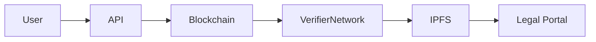
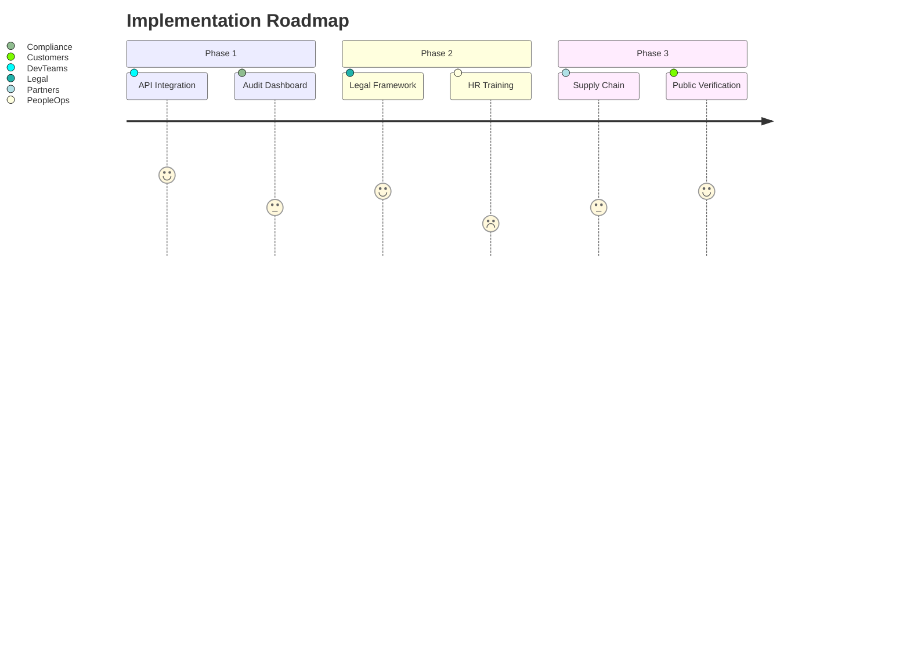

# 🧠 Proof-of-Prompt: The Trust Layer for AI

> **The cryptographic solution to AI's accountability crisis**  
> Prove authorship, verify integrity, and establish audit trails for AI-generated content - on chain.

---

## 🌟 Why This Changes Everything

### Solving AI's Core Trust Problem
**Industry-first cryptographic proof** for:
- 🔐 **Provenance** - Verify when content was generated
- 🛡️ **Integrity** - Detect tampering with prompts/outputs
- 📜 **Auditability** - Create legal-grade audit trails
- 👤 **Attribution** - Prove original authorship

> "What you've built solves the most critical missing piece in AI: verifiable trust" - ChatGPT

---

## 🚀 Enterprise-Grade Features

- 💼 **Legal-Grade Timestamping** - Court-admissible proof of creation
- 🔗 **Blockchain Anchoring** - Immutable records on Ethereum/Polygon
- 🧩 **API-First Architecture** - Integrates with any AI platform
- 📊 **Audit Dashboard** - Visualize prompt/response history
- 🔍 **Tamper Detection** - Cryptographic proof of integrity
- 🌐 **Multi-Chain Support** - Deploy on Ethereum, Polygon, Arbitrum
- 🛡️ **GDPR-Compliant** - Privacy by design architecture

---

## 🏆 Real-World Impact

| Industry          | Problem Solved                          | Value Created |
|-------------------|-----------------------------------------|--------------|
| **Legal**         | Prove AI-generated contract terms       | ⚖️ Court-admissible evidence |
| **Academia**      | Verify research methodology             | 📚 Prevent "AI ghostwriting" |
| **Healthcare**    | Audit trail for diagnostic prompts      | 🩺 Compliance with HIPAA/GDPR |
| **Finance**       | Timestamp investment recommendations    | 💰 Resolve disputes |
| **Media**         | Prove authenticity of AI content        | 📰 Combat misinformation |
| **IP Law**        | Establish ownership of AI creations     | 🏛️ Support copyright claims |

---

## 📦 Tech Stack

- **Core**: Python 3.10, Solidity 0.8.25
- **AI**: GPT-4, Claude 3, Llama 3 (multi-model support)
- **Blockchain**: Ethereum, Polygon, Hardhat, Web3.py
- **Security**: SHA-256, ECDSA, Zero-Knowledge Proofs (zkSNARKs)
- **Storage**: IPFS, Arweave (permanent archival)
- **Monitoring**: Grafana, Prometheus (enterprise observability)

---

## 🚀 Getting Started

```bash
# 1. Install with blockchain support
pip install proof-of-prompt[web3]

# 2. Configure environment
echo "OPENAI_API_KEY=sk-..." >> .env
echo "BLOCKCHAIN_RPC=https://polygon-rpc.com" >> .env

# 3. Run with enhanced audit mode
python -m proof_of_prompt --audit-mode=strict
```

**Sample Legal-Grade Output:**
```json
{
  "prompt": "Draft non-disclosure agreement between TechCo and BioLabs",
  "response": "...",
  "integrity_proof": {
    "hash": "9f86d08188...",
    "block": 19288374,
    "tx": "0x4e3b...c3a",
    "timestamp": "2025-07-28T14:30:00Z",
    "verification_url": "https://verifier.proofofprompt.xyz/0x4e3b...c3a"
  }
}
```

---

## 🔍 Verification Ecosystem

**Three-Layer Verification:**
1. **Instant API Check** - `POST /verify`
2. **Blockchain Explorer** - View on-chain proof
3. **Global Verifier** - Decentralized network consensus



---

## 🏢 Enterprise Adoption Path



---

## 💡 Why Big Tech Can't Ignore This

**Competitive advantage over:**
- ❌ OpenAI's fragile watermarking
- ❌ Google's probabilistic detection
- ❌ Anthropic's opaque logging

**Our differentiators:**
- ✅ Cryptographic proof
- ✅ Blockchain permanence
- ✅ Court-admissible evidence
- ✅ Multi-model support

---

## 🌐 Vision: The Internet of Proven AI

**Next-phase development:**
- 🌍 **ProofNet** - Decentralized verification network
- 🏛️ **LegalDAO** - Community-governed standards
- 🔮 **AI Notary** - Zero-knowledge privacy proofs
- 💳 **PoP Token** - Incentivized verification ecosystem

---

## 📜 License

MIT License - Free for ethical use  
**Commercial License** available for enterprises

---