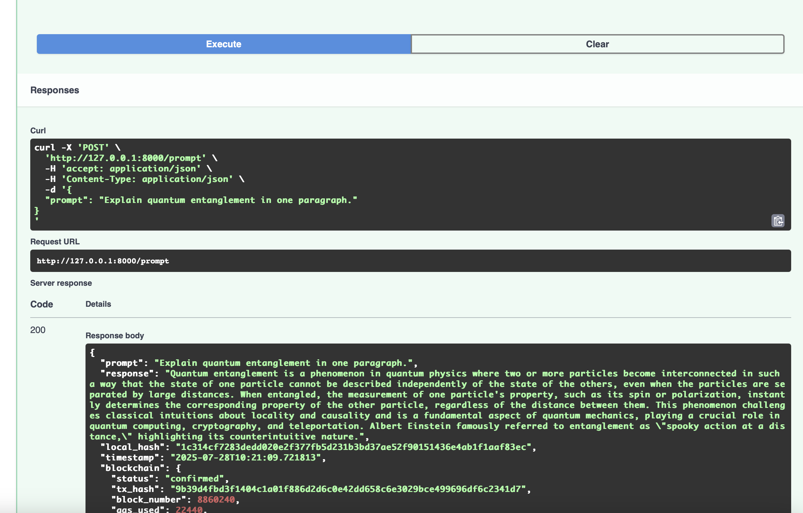
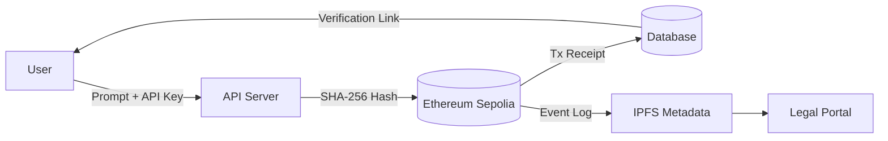

# 🧠 Proof-of-Prompt  
> *The first cryptographic notary for AI prompts and outputs—anchored to blockchain for tamper-proof verification.*
>
> https://github.com/user-attachments/assets/55f332b0-7cff-4322-90ef-15ef7d1b8d01

> **Solving the trust crisis in AI.**  
Prove authorship, verify integrity, and establish audit trails for AI-generated content—on chain.

**🌐 Live Demo**: [Frontend](https://frontend-proof-of-prompt-restored-3i7u75dcx.vercel.app/generate) | [Backend API](https://proof-of-prompt-backend.onrender.com/docs)

---

## 🌟 Why This Changes Everything

### The First Verifiable Trust Layer for AI

* 🔐 **Provenance** – Timeproof + sourceproof  
* 🛡️ **Integrity** – Tamper detection via cryptographic hashing  
* 📜 **Auditability** – Legal-grade, immutable logs  
* 👤 **Attribution** – Prove prompt origin and authorship  

> *"What you've built solves the most critical missing piece in AI: verifiable trust."* — ChatGPT

---

## 🚀 Key Features

* 💼 Legal-Grade Timestamping  
* 🔗 Blockchain Anchoring (Ethereum Sepolia)  
* 🧠 Prompt & Response Hashing Engine  
* 📊 Audit Dashboard (Merkle root + block explorer)  
* 🌐 Multi-Chain Support  
* 🔍 Tamper-Proofing (SHA-256 + zk pipeline-ready)  
* 🧩 Open API + CLI  
* 🛡️ GDPR/HIPAA-Conscious Privacy Design

---

## 📦 Tech Stack

* **Backend**: FastAPI, Python 3.10, SQLAlchemy
* **Frontend**: Next.js 15, React 19, TypeScript, Tailwind CSS
* **Blockchain**: Solidity 0.8.25, Web3.py, Ethereum Sepolia
* **Deployment**: Render (Backend), Vercel (Frontend)
* **Hashing**: SHA-256, BLAKE3
* **AI Integration**: OpenAI GPT-4, Claude 3
* **Security**: ECDSA, Rate Limiting, CORS

---

## 🛠️ Complete Setup Guide

### Prerequisites

- Python 3.10+
- Node.js 18+
- Git
- OpenAI API Key
- Ethereum Sepolia testnet wallet with ETH

### 1. Backend Setup (Render)

#### Clone the Repository
```bash
git clone https://github.com/jondevcodes/proof-of-prompt3
cd proof-of-prompt3
```

#### Environment Configuration
Create a `.env` file in the root directory:

```bash
# Backend Environment Variables
OPENAI_API_KEY=your_openai_api_key_here
WEB3_PROVIDER_URL=https://sepolia.infura.io/v3/your_project_id
CONTRACT_ADDRESS=0xc01026685E93C4E63480865D3B011FF54e655720
PRIVATE_KEY=your_private_key_here
DATABASE_URL=sqlite:///proofs.db
ENVIRONMENT=production
ALLOWED_ORIGINS=https://frontend-proof-of-prompt-restored-3i7u75dcx.vercel.app

# Optional Settings
MAX_PRIORITY_FEE_PER_GAS=2
```

#### Install Dependencies
```bash
pip install -r requirements.txt
```

#### Local Development
```bash
uvicorn main:app --reload --host 0.0.0.0 --port 8000
```

#### Deploy to Render

1. **Connect Repository**: Link your GitHub repo to Render
2. **Create Web Service**:
   - **Build Command**: `pip install -r requirements.txt`
   - **Start Command**: `uvicorn main:app --host 0.0.0.0 --port $PORT`
   - **Environment**: Python

3. **Environment Variables** (set in Render dashboard):
   ```
   OPENAI_API_KEY=your_openai_api_key
   WEB3_PROVIDER_URL=https://sepolia.infura.io/v3/758ba43ab1b448de9d6dd0a2449f320c
   CONTRACT_ADDRESS=0xc01026685E93C4E63480865D3B011FF54e655720
   PRIVATE_KEY=your_private_key
   MAX_PRIORITY_FEE_PER_GAS=2
   ALLOWED_ORIGINS=https://frontend-proof-of-prompt-restored-3i7u75dcx.vercel.app
   ```

### 2. Frontend Setup (Vercel)

#### Navigate to Frontend Directory
```bash
cd frontend-proof-of-prompt-restored
```

#### Install Dependencies
```bash
npm install
```

#### Environment Configuration
Create a `.env.local` file:

```bash
# Frontend Environment Variables
NEXT_PUBLIC_API_BASE_URL=https://your-backend-url.onrender.com
NEXT_PUBLIC_CHAIN_ID=11155111  # Sepolia testnet
```

#### Local Development
```bash
npm run dev
```

#### Deploy to Vercel

1. **Connect Repository**: Link your GitHub repo to Vercel
2. **Build Settings**:
   - **Framework Preset**: Next.js
   - **Root Directory**: `frontend-proof-of-prompt-restored`
   - **Build Command**: `npm run build`
   - **Output Directory**: `.next`

3. **Environment Variables** (set in Vercel dashboard):
   ```
   NEXT_PUBLIC_API_BASE_URL=https://your-backend-url.onrender.com
   NEXT_PUBLIC_CHAIN_ID=11155111
   ```

### 3. Smart Contract Setup

#### Contract Address (Sepolia Testnet)
```
0xc01026685E93C4E63480865D3B011FF54e655720
```

#### Contract ABI
The contract ABI is stored in `contracts/ProofAnchor.json`. The contract provides:
- `anchorHash(bytes32 hash)` - Anchor a prompt hash to blockchain
- `verifyHash(bytes32 hash)` - Verify if a hash exists on-chain

#### Deploy Your Own Contract (Optional)

1. **Compile Contract**:
   ```bash
   solc --abi contracts/blockchain.sol -o contracts/
   ```

2. **Deploy to Sepolia**:
   - Use Remix IDE or Hardhat
   - Fund your deployment wallet with Sepolia ETH
   - Update `CONTRACT_ADDRESS` in environment variables

### 4. Blockchain Configuration

#### Required Setup
1. **Infura Account**: Create account at [infura.io](https://infura.io)
2. **Sepolia Testnet**: Get free ETH from [sepoliafaucet.com](https://sepoliafaucet.com)
3. **Private Key**: Export your wallet's private key (for transaction signing)

#### Environment Variables Explained
- `WEB3_PROVIDER_URL`: Your Infura Sepolia endpoint
- `CONTRACT_ADDRESS`: Deployed smart contract address
- `PRIVATE_KEY`: Wallet private key for signing transactions
- `OPENAI_API_KEY`: Your OpenAI API key for AI responses

---

## 🧪 API Endpoints

### Core Endpoints
- `POST /prompt` - Generate AI response and anchor to blockchain
- `POST /verify` - Verify prompt/response integrity
- `GET /api/proofs/{tx_hash}` - Get proof by transaction hash
- `GET /health` - Health check
- `GET /docs` - Interactive API documentation

### Example Usage

#### Generate Proof
```bash
curl -X POST "https://your-backend.onrender.com/prompt" \
  -H "Content-Type: application/json" \
  -d '{
    "prompt": "Write a simple NDA",
    "model": "gpt-4o",
    "temperature": 0.7
  }'
```

---

## 🧪 Sample Output (Testnet)

Below is a successful end-to-end interaction:

```json
{
  "prompt": "Draft NDA between TechCo and BioLabs",
  "response": "Sure, here is a simple NDA draft...",
  "local_hash": "0d4fa9305a7d5f06c87f7f6e221f6dbcb7e9398651c03de911107d8366b8cdaf",
  "timestamp": "2025-01-28T14:30:00Z",
  "blockchain": {
    "tx_hash": "0x8bf9d366797e0f07e9eb5a154e5a3e68325bbd565463a0546b39ed4b4a89e3ff",
    "block_number": 6433345,
    "verification_url": "https://sepolia.etherscan.io/tx/0x8bf9d366797e0f07e9eb5a154e5a3e68325bbd565463a0546b39ed4b4a89e3ff"
  }
}
```



[![Etherscan Verified]](https://sepolia.etherscan.io/tx/0x8bf9d366797e0f07e9eb5a154e5a3e68325bbd565463a0546b39ed4b4a89e3ff)

---

## 🔧 Quick Verify (Testnet)

```bash
curl https://your-backend.onrender.com/verify/0x8bf9d366797e0f07e9eb5a154e5a3e68325bbd565463a0546b39ed4b4a89e3ff
```

---

## 🔍 Verification Flow



---

## 🏗️ Project Structure

```
proof-of-prompt3/
├── main.py                 # FastAPI application
├── blockchain.py           # Blockchain integration
├── prompt_handler.py       # AI prompt processing
├── requirements.txt        # Python dependencies
├── render.yaml            # Render deployment config
├── contracts/
│   ├── blockchain.sol     # Smart contract
│   └── ProofAnchor.json   # Contract ABI
├── frontend-proof-of-prompt-restored/
│   ├── src/
│   │   ├── app/          # Next.js pages
│   │   ├── components/   # React components
│   │   ├── lib/          # Utilities
│   │   └── utils/        # API utilities
│   ├── package.json      # Node dependencies
│   └── next.config.js    # Next.js config
└── docs/                 # Documentation
```

---

## 💡 Competitive Edge

| Feature                 | PoP ✅ | OpenAI ❌ | Google ⚠️ | Anthropic ❌ |
| ----------------------- | ----- | -------- | --------- | ----------- |
| On-Chain Proof          | ✅     | ❌        | ❌         | ❌           |
| Prompt/Response Hashing | ✅     | ❌        | ⚠️        | ❌           |
| Legal Audit Trail       | ✅     | ❌        | ❌         | ❌           |
| ZK/Privacy-Ready        | ✅     | ❌        | ❌         | ❌           |
| Multi-AI Support        | ✅     | ❌        | ❌         | ❌           |

---

## 🚨 Troubleshooting

### Common Issues

1. **Blockchain Connection Failed**
   - Verify `WEB3_PROVIDER_URL` is correct
   - Check if Infura project is active
   - Ensure Sepolia network is selected

2. **Transaction Failed**
   - Verify wallet has sufficient Sepolia ETH
   - Check `PRIVATE_KEY` format (should start with 0x)
   - Ensure gas settings are appropriate

3. **Frontend Can't Connect to Backend**
   - Verify `NEXT_PUBLIC_API_BASE_URL` is correct
   - Check CORS settings in backend
   - Ensure backend is deployed and running

4. **OpenAI API Errors**
   - Verify `OPENAI_API_KEY` is valid
   - Check API key has sufficient credits
   - Ensure model name is correct (gpt-4o, gpt-3.5-turbo, claude-3)

### Debug Commands

```bash
# Test blockchain connection
python -c "from blockchain import test_blockchain_connection; test_blockchain_connection()"

# Check environment variables
python -c "import os; from dotenv import load_dotenv; load_dotenv(); print('OPENAI_API_KEY:', bool(os.getenv('OPENAI_API_KEY'))); print('WEB3_PROVIDER_URL:', bool(os.getenv('WEB3_PROVIDER_URL')))"

# Test API locally
curl http://localhost:8000/health
```

---

## 🌐 Future Vision

> Every prompt. Every output. Permanently sealed.

* 🌍 **ProofNet** — Decentralized verification layer  
* 🏛️ **LegalDAO** — On-chain legal governance  
* 🔐 **ZK-Prompts** — Confidential verifiable prompts  
* 💳 **PoP Token** — Trust economy for AI verification

---

## 👥 Join the Movement

* Star ⭐ this repo  
* Contribute via Issues + PRs  
* Run a verifier node:

```bash
docker-compose up
```

---

## 🛡️ License

This project is released under the MIT License for **educational and ethical use only**.

**Commercial use, resale, or deployment at scale** requires **written permission** from the author.

Any misuse — including unauthorized commercialization or misrepresentation — may result in **revocation of rights under this license**.

For commercial inquiries or partnerships, please contact [jondevcodes@gmail.com].

---

## ✅ Ready to Ship

```bash
git add README.md docs/prompt-demo-success.png
git commit -m "feat: updated README with complete setup guide"
git push origin main
```

---

**Built with ❤️ by [@jondevcodes](https://github.com/jondevcodes)**
