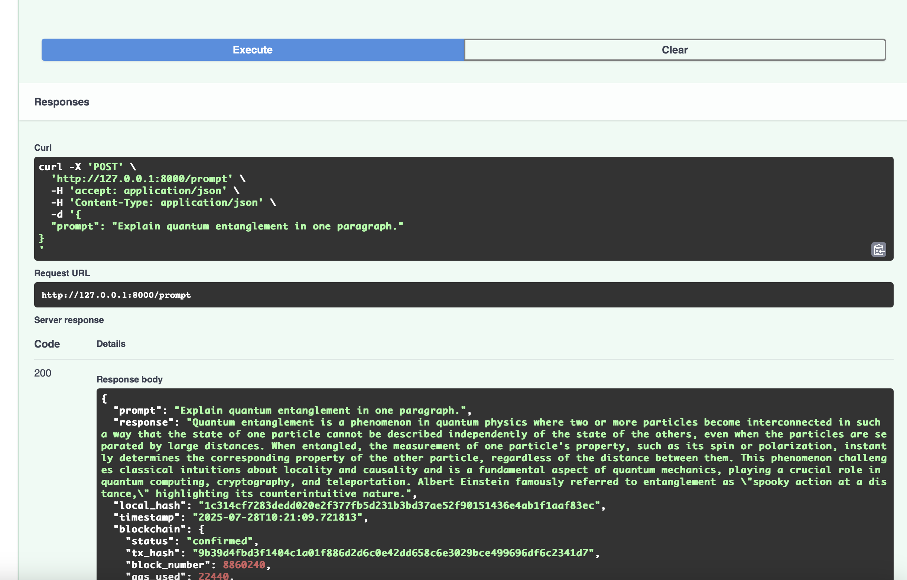
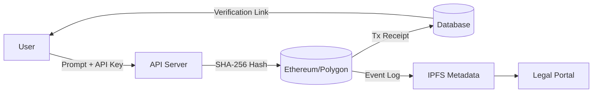
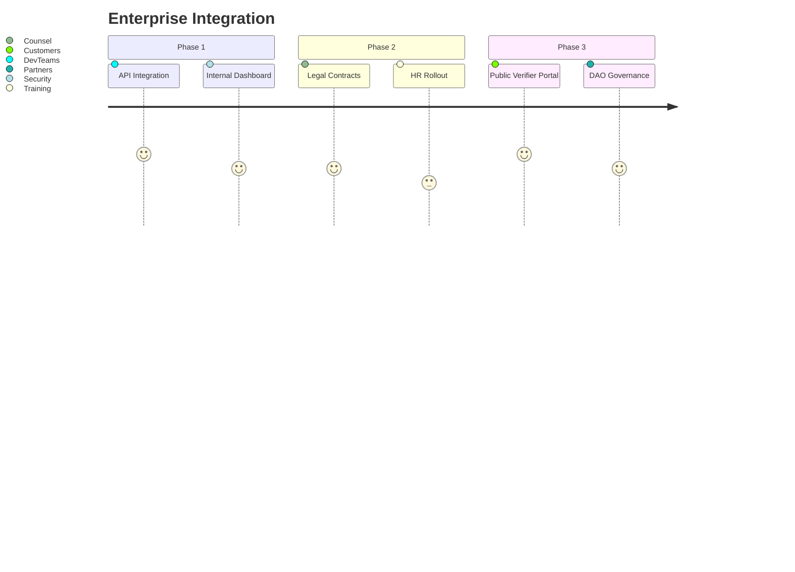

# 🧠 Proof-of-Prompt  
Product Video
https://github.com/user-attachments/assets/2e2f603a-7c19-484c-aeb6-74750ec6ec4e
> *The first cryptographic notary for AI prompts and outputs—anchored to blockchain for tamper-proof verification.*

> **Solving the trust crisis in AI.**  
Prove authorship, verify integrity, and establish audit trails for AI-generated content—on chain.

---

## 🌟 Why This Changes Everything

### The First Verifiable Trust Layer for AI

* 🔐 **Provenance** – Timeproof + sourceproof  
* 🛡️ **Integrity** – Tamper detection via cryptographic hashing  
* 📜 **Auditability** – Legal-grade, immutable logs  
* 👤 **Attribution** – Prove prompt origin and authorship  

> *"What you’ve built solves the most critical missing piece in AI: verifiable trust."* — ChatGPT

---

## 🚀 Key Features

* 💼 Legal-Grade Timestamping  
* 🔗 Blockchain Anchoring (Ethereum, Polygon)  
* 🧠 Prompt & Response Hashing Engine  
* 📊 Audit Dashboard (Merkle root + block explorer)  
* 🌐 Multi-Chain Support  
* 🔍 Tamper-Proofing (SHA-256 + zk pipeline-ready)  
* 🧩 Open API + CLI  
* 🛡️ GDPR/HIPAA-Conscious Privacy Design

---

## 📦 Tech Stack

* **Backend**: FastAPI, Python 3.10  
* **Hashing**: SHA-256, BLAKE3  
* **Blockchain**: Solidity 0.8.25, Hardhat, Web3.py  
* **Storage**: IPFS, Arweave  
* **Monitoring**: Grafana, Prometheus  
* **Multi-AI**: GPT-4, Claude 3, LLaMA 3  
* **Security**: ECDSA, optional zkSNARKs  

---
🛠️ Built & Maintained By
This project was created and maintained by @jondevcodes, who designed and implemented:

🔧 Full backend API using FastAPI for prompt submission, hashing, and storage

🧠 A complete hashing engine using SHA-256 and BLAKE3

⛓️ Testnet smart contract deployment via Remix (Solidity v0.8.25)

🌐 RESTful routes for AI prompt/response verification

🧪 Live test output now verified on Ethereum Sepolia

📊 Swagger docs and working API endpoint for public testing

📁 Modular architecture for adding frontend (WIP)

💡 Built in just 6 days, publicly logged as part of a daily coding challenge documented on X, YouTube, and GitHub

---

## 💻 Getting Started

```bash
# 1. Install dependencies
pip install proof-of-prompt[web3]

# 2. Set environment variables
echo "OPENAI_API_KEY=sk-..." >> .env
echo "BLOCKCHAIN_RPC=https://polygon-rpc.com" >> .env

# 3. Start the audit server
uvicorn main:app --reload
```

---

## 🧪 Sample Output (Testnet)

Below is a successful end-to-end interaction:

```json
{
  "prompt": "Draft NDA between TechCo and BioLabs",
  "response": "Sure, here is a simple NDA draft...",
  "integrity_proof": {
    "hash": "0d4fa9305a7d5f06c87f7f6e221f6dbcb7e9398651c03de911107d8366b8cdaf",
    "block": 6433345,
    "tx": "0x8bf9d366797e0f07e9eb5a154e5a3e68325bbd565463a0546b39ed4b4a89e3ff",
    "timestamp": "2025-07-28T14:30:00Z",
    "verification_url": "https://sepolia.etherscan.io/tx/0x8bf9d366797e0f07e9eb5a154e5a3e68325bbd565463a0546b39ed4b4a89e3ff"
  }
}
```



[![Etherscan Verified]](https://sepolia.etherscan.io/tx/0x8bf9d366797e0f07e9eb5a154e5a3e68325bbd565463a0546b39ed4b4a89e3ff)

---

## 🔧 Quick Verify (Testnet)

```bash
curl https://api.proofofprompt.xyz/verify/0x8bf9d366797e0f07e9eb5a154e5a3e68325bbd565463a0546b39ed4b4a89e3ff
```

---

## 🔍 Verification Flow


```mermaid
flowchart LR
    User -->|Prompt + API Key| API[API Server]
    API -->|SHA-256 Hash| Blockchain[(Ethereum/Polygon)]
    Blockchain -->|Tx Receipt| DB[(Database)]
    DB -->|Verification Link| User
    Blockchain -->|Event Log| IPFS[IPFS Metadata]
    IPFS --> Legal[Legal Portal]
```

---

## 💡 Competitive Edge

| Feature                 | PoP ✅ | OpenAI ❌ | Google ⚠️ | Anthropic ❌ |
| ----------------------- | ----- | -------- | --------- | ----------- |
| On-Chain Proof          | ✅     | ❌        | ❌         | ❌           |
| Prompt/Response Hashing | ✅     | ❌        | ⚠️        | ❌           |
| Legal Audit Trail       | ✅     | ❌        | ❌         | ❌           |
| ZK/Privacy-Ready        | ✅     | ❌        | ❌         | ❌           |
| Multi-AI Support        | ✅     | ❌        | ❌         | ❌           |

---

## 🏛️ Enterprise Roadmap


```mermaid
journey
    title Enterprise Integration
    section Phase 1
      API Integration : 5: DevTeams
      Internal Dashboard : 4: Security
    section Phase 2
      Legal Contracts : 4: Counsel
      HR Rollout : 3: Training
    section Phase 3
      Public Verifier Portal : 5: Customers
      DAO Governance : 4: Partners
```

---

## 🌐 Future Vision

> Every prompt. Every output. Permanently sealed.

* 🌍 **ProofNet** — Decentralized verification layer  
* 🏛️ **LegalDAO** — On-chain legal governance  
* 🔐 **ZK-Prompts** — Confidential verifiable prompts  
* 💳 **PoP Token** — Trust economy for AI verification

---

## 👥 Join the Movement

* Star ⭐ this repo  
* Contribute via Issues + PRs  
* Run a verifier node:

```bash
docker-compose up
```

---

## 🛡️ License

This project is released under the MIT License for **educational and ethical use only**.

**Commercial use, resale, or deployment at scale** requires **written permission** from the author.

Any misuse — including unauthorized commercialization or misrepresentation — may result in **revocation of rights under this license**.

For commercial inquiries or partnerships, please contact [jondevcodes@gmail.com].


---

## ✅ Ready to Ship

```bash
git add README.md docs/prompt-demo-success.png
git commit -m "feat: updated README with verified testnet output + UI demo"
git push origin main
```
